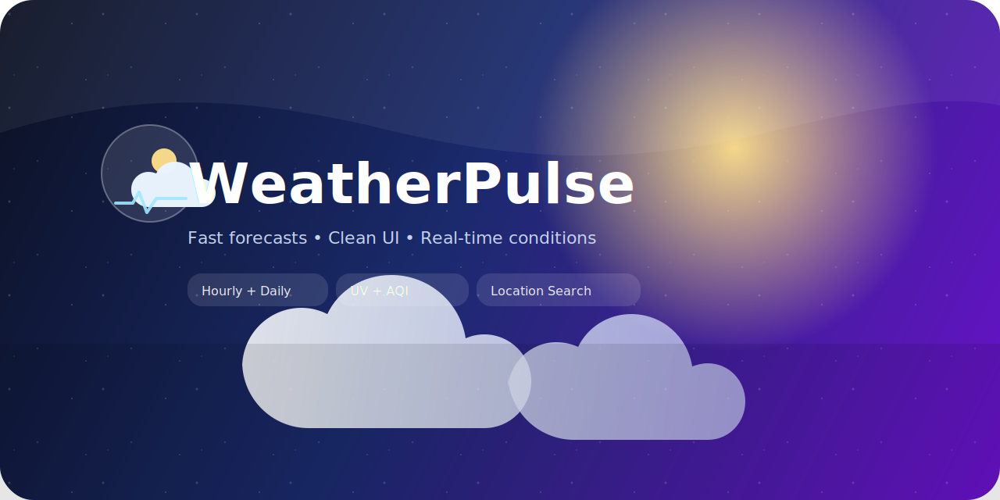

<h1>
  
  WeatherPulse
</h1>
<br clear="left" />



A full-stack weather dashboard with accounts, saved locations, alerts, AQI insights, and a polished UI inspired by modern weather apps.

## Highlights

- City, place, and address search with live suggestions
- Current conditions, hourly chart, and 7-day outlook
- AQI details + health tips
- Saved locations with compare view
- Alert subscriptions (with optional email sender)
- Offline fallback + rate-limit handling with cached data
- Dark mode + custom UI theming

## Tech Stack

- Frontend: React + Vite + Tailwind CSS
- Backend: Django + DRF
- Auth: JWT
- Cache: Redis (optional, configured)

## Project Structure

```
weatherpulse/
  backend/
  frontend/
  docker-compose.yml
  .env
```

## Frontend Scripts

```
npm run dev
npm run build
npm run preview
```

## Backend Commands

```
python manage.py migrate
python manage.py runserver
python manage.py send_alerts
```

## API Endpoints (Backend)

- `GET /api/weather?city=...` or `GET /api/weather?lat=...&lon=...`
- `GET /api/aqi?lat=...&lon=...`
- `GET /api/alerts?lat=...&lon=...`
- `POST /api/auth/register`
- `POST /api/auth/token`
- `GET /api/me`
- `GET/POST /api/saved-locations`
- `DELETE /api/saved-locations/:id`
- `GET/POST /api/alert-subscriptions`
- `DELETE /api/alert-subscriptions/:id`
- `GET/PUT /api/preferences`

## Deployment Notes

- Set `DJANGO_SECRET_KEY`, `DJANGO_ALLOWED_HOSTS`, `CORS_ALLOWED_ORIGINS`, and `VITE_API_BASE`.
- Keep `.env` secrets out of version control.

## Quick Start (Local)

Backend:
```
cd weatherpulse/backend
python3 -m venv venv
source venv/bin/activate
pip install -r requirements.txt
python manage.py migrate
python manage.py runserver
```

Frontend:
```
cd weatherpulse/frontend
npm install
npm run dev
```

Open `http://localhost:5173`.

## Docker (Dev)

```
docker compose -f weatherpulse/docker-compose.yml up --build
```

## Environment Variables

`weatherpulse/.env`:
```
REDIS_URL=redis://localhost:6379/0
SENDGRID_API_KEY=
ALERTS_FROM_EMAIL=
ALERTS_MIN_INTERVAL_MINUTES=30
DJANGO_SECRET_KEY=
DJANGO_DEBUG=0
DJANGO_ALLOWED_HOSTS=localhost,127.0.0.1
CORS_ALLOWED_ORIGINS=http://localhost:5173,http://127.0.0.1:5173
VITE_API_BASE=http://localhost:8000/api
NEWS_API_KEY=
```

## Email Alerts (SendGrid)

The app stores alert subscriptions. To send emails, run the management command:
```
cd weatherpulse/backend
python manage.py send_alerts
```

Schedule it via cron every 15–30 minutes if desired.

## Notes

- Full address search uses OpenStreetMap Nominatim for geocoding.
- "Use my location" relies on browser geolocation permissions.
- Local time display respects user time format preferences.

## License

MIT
